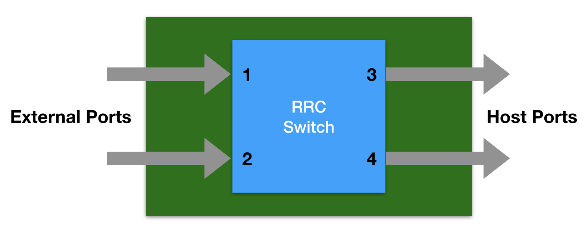

nBroker
=======

Achieving full network visibility requires a combination of a wide range of monitoring tools for real-time analysis.
It is really important to efficiently steer traffic from the network to each tool that needs it, or to filter it both
to do selective analysis reducing the load on the monitoring tools, or to block it in inline applications.

nBroker is a framework that can be used for configuring traffic steering and filtering at 100 Gbit on Intel RRC chipsets (FM10K adapters). The FM10K adapter has an internal switch wich is connected to the external (EPL) ports of the NIC, those connected to the physical cables, and to the internal (PEP) ports seen by the host OS: in a typical configuration the adapter has 2 external ports and 2 internal ports.

nBroker consists of a daemon that drive the RRC switch, and an API that can be used to control the daemon and configure  steering and filtering rules. In addition to the API, a command-line tool with auto-completion is also provided to control the adapter.

.. toctree::
    :maxdepth: 2
    :numbered:

    installation
    nbrokerd
    api
    cli

