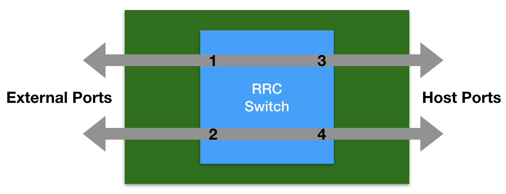

nBrokerd Daemon
===============

The nbrokerd daemon provides a client-server pattern to communicate with the RRC physical device.

The daemon can be started running "nbrokerd"

.. code-block:: console

   nbrokerd

Please note that nbrokerd requires root privileges to drive the RRC switch.

According to the cables you are using, the RRC library requires different settings to configure the switch, those settings are contained in various configuration files in /etc/rrc. By default nbrokerd loads the /etc/rrcfm_platform_attributes.cfg file which is suitable for fiber, other configuration files are available under /etc/rrc for DAC cables and Breakout cables and can be selected with the --rrc-config-file option. Example with DAC cables:

.. code-block:: console

   nbrokerd --rrc-config-file /etc/rrc/fm_platform_attributes_dac.cfg

This daemon allows multiple clients to access the switch configuration at the same time, to set rules on the RRC device. It also overcomes the limited number of rules supported by the device, as it supports rules deduplication.

It is possible to communicate with the daemon in a couple of ways:

- text: commands are exchanged in string format (see nbroker-cli), making this mode suitable for manual user interaction and debugging.
- binary: commands are exchanged in binary format (see the API).

Please note that there is some difference in the supported features between the two modes: text mode supports a subset of the full features list.

Basic Knowledge
---------------

The RRC device has an internal switch that can be configured to apply policies on the traffic. The switch has internal (those seen by the host OS) and external (connected to the physical cables) ports, in a typical configuration 2 external ports and 2 internal ports. 

It supports two kind of policies:

- egress filtering, affecting packets *going out* a switch port, with the ability to set 'pass' or 'drop' rules.
- ingress steering, affecting packets *coming in* a switch port, with the ability to set 'forward' rules for steering packets to a secondary port, either internal or external, of the switch.

In order to simulate a typical network card, upon initialization the daemon binds the internal ports to the external ports by means of default steering policies. This way, the traffic coming from or going to the physical ports can reach the host OS.

For each port, the filtering and steering rules are handled differently by the device. The tuple <port, filter_type> defines the context of a specified rule, where filter_type is of of "steering" or "filtering".

A *rule* is a simple <match, policy> tuple. It specifies what policy to apply on traffic matching the specified fields. A rule is identified, whithin the <port, filter_type> context, thorugh a rule id number. The daemon is able to handle rule ids automatically and to avoid duplicate rules, although the user has the possibility to override its behaviour using specific rule ids.

Since the rules are matched in numerical order, the rule id can be used by the user to impose a desired rule match order. The *default rule* is just a rule which is applied when no other rules matches are found.

The daemon API supports symbolic interface names to be used in place of the numerical port indexes. When symbolic names are used, the following convention is assumed:

- filtering rules are applied on the *internal* switch port, so that the bad traffic is dropped and it won't even reach the host
- steering rules are applied on the *external* switch ports, so that the traffic coming from the wire on port A will be redirected to the wire on port B without even reaching the host

This convention matches the scenario of an IDS system which is bridging traffic between the two RRC ports, dropping the unwanted traffic or steering the traffic which is known to be good for sure to reduce the cpu load. This convention can be avoided by using numeric port indexes in place of the symbolic interface names.

